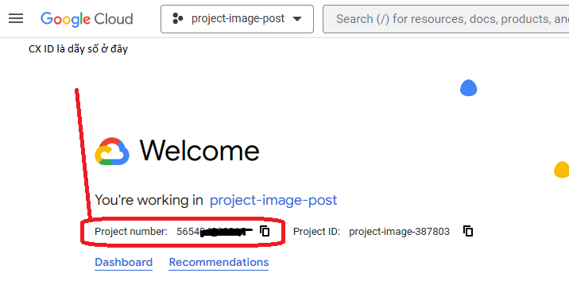
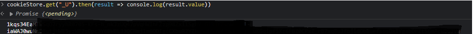

# Dự án Tạo Ảnh và Xóa Văn bản

Dự án này sử dụng công nghệ xử lý ngôn ngữ tự nhiên và hình ảnh để tạo ra ảnh mới dựa trên mô tả văn bản và xóa văn bản từ các ảnh tải xuống từ Google Images.

## Cài đặt

1. Sao chép mã nguồn từ kho lưu trữ:

   ```
   git clone https://github.com/your-username/your-repo.git
   ```

2. Di chuyển vào thư mục dự án:

   ```
   cd your-repo
   ```

3. Cài đặt các gói phụ thuộc:

   ```
   npm install 
   ```

4. Cấu hình các API key :

   - Nhận CX_ID bằng 1 project theo hướng dẫn từ trang [Google Custom Search API](https://developers.google.com/custom-search/v1/overview).
   (Tạo project Google nếu chưa có)

      
   
   - Nhận API_KEY tạo ra từ CX_ID đó. 
   - Trong file `.env`, thay thế giá trị `GOOGLE_API_KEY` và `GOOGLE_CX_ID` bằng API key và Custom Search Engine ID của bạn. 

   ```
   GOOGLE_API_KEY = AInjns1d_-********************
   GOOGLE_CX_ID = 5654**********
   ```

   - Cũng trong file `.env` trên, thay thế giá trị `OPENAI_API_KEY` bằng API key của bạn từ OpenAI. Nhận API key từ trang [OpenAI API Account](https://platform.openai.com/account/api-keys).

   ```
   OPENAI_API_KEY = "sk-**************************";
   ```

   - Thay thế giá trị `CLIPDROP_API_KEY` bằng API key của bạn từ Clipdrop. 
   Nhận API key từ trang [Clipdrop API Documentation](https://clipdrop.co/apis/account).

   ```
   CLIPDROP_API_KEY = "afsjq***************************************************************";
   ```

   - Lấy cookie Bing Image: Trên Chrome, Edge, Opera
         - Mở trang https://bing.com/.
         - __F12__ hoặc __Ctrl__ + __Shift__ + __I__ để mở devtool
         - Tìm tới tab Console, dán lệnh `cookieStore.get("_U").then(result => console.log(result.value))` và __Enter__   
         - Copy kết quả 
            
         
         - Dán Cookies vừa tìm được vào file `.env` tại vị trí chỉ định

         ```
         BING_IMAGE_COOKIE = 1tr_******* ... ****
         ```

   - Lấy API-KEY của Huggingface tại [đây](https://huggingface.co/settings/tokens)

   ```
   HUGGINGFACE_API_KEY = hf_************************
   ```
   
## Sử dụng

1. Tìm ảnh liên quan từ Google Images:
   - Chạy lệnh sau để tìm ảnh liên quan từ Google Images:

     ```
     node run_scripts.js
     ```

   - Ảnh được tìm thấy sẽ được lưu trong các thư mục con của thư mục `download`, tên các thư mục con là nội dung tìm kiếm (giá trị 'q' trong params).

2. Trích xuất mô tả từ ảnh:
   - Chạy lệnh sau để trích xuất mô tả từ ảnh:

     ```
     node image_to_text.js
     ```

   - Mô tả và ảnh tương ứng được lưu trong file `image_to_text.json`.

3. Tạo ảnh nền dựa trên từ khóa và mô tả:
   - Chạy lệnh sau để tạo ảnh nền:

     ```
     node generate_img.js
     ```

   - Các ảnh được tạo ra nằm trong thư mục `generated`, nằm trong các thư mục con của thư mục `download`.

4. Xóa văn bản từ ảnh:
   - Chạy lệnh sau để xóa văn bản từ ảnh:

     ```
     node clipdrop.js
     ```

   - Các ảnh được tạo ra nằm trong thư mục `remove_text`, nằm trong các thư mục con của thư mục `download`.

5. Ghép ảnh đã xóa văn bản và ảnh chứa văn bản phù hợp:
   - Sử dụng phần mềm Photoshop hoặc các công cụ khác để ghép ảnh đã xóa văn bản và ảnh chứa văn bản phù hợp.
   - Tạo một ảnh hoàn chỉnh với văn bản đã được xóa.

## Cấu trúc thư mục

- **download**: Thư mục chứa các ảnh tải xuống từ Google Images.
- **\<folder-name\>**: Thư mục con chứa các ảnh dựa trên từ khóa tìm kiếm.
  - **generated**: Thư mục chứa các ảnh nền đã được tạo ra từ mô hình DALL-E.
  - **remove_text**: Thư mục chứa các ảnh đã xóa văn bản bằng Clipdrop.

## Yêu cầu

- Node.js (phiên bản 14 trở lên)

## Tài liệu tham khảo

- [OpenAI API Documentation](https://platform.openai.com/)
- [Clipdrop API Documentation](https://clipdrop.co/developers/)
- [Huggingface](https://huggingface.co/Salesforce/blip-image-captioning-large)
- [DALL-E](https://openai.com/research/publications/dall-e)